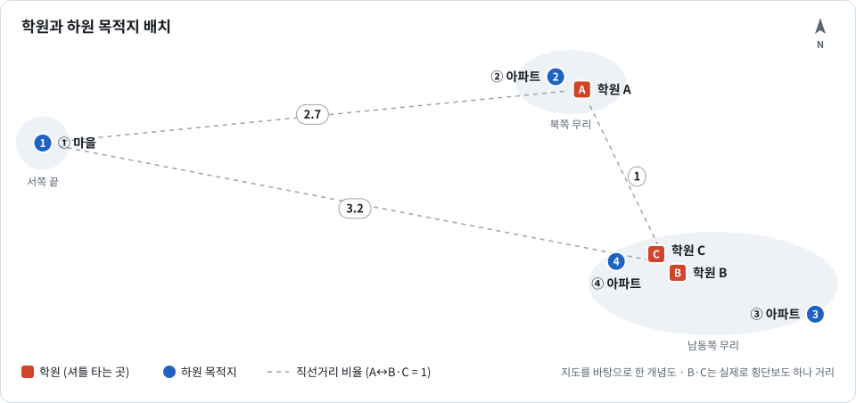

# 학원 셔틀 배차 최적화

학원 셔틀 한 대로 여러 학원의 학생들을 집에 데려다주는 **하원 운행표를 자동으로 짜는** 프로젝트입니다.

> **지금 단계:** 현장 상황을 정리하고 있습니다. 아직 실행할 수 있는 코드는 없습니다.

## 풀려는 문제

학원 세 곳이 스타렉스 셔틀 한 대를 함께 씁니다. 수업이 끝나면 학생들은 이 셔틀을 타고 크게 네 곳으로 흩어져 집에 갑니다.

차가 한 대뿐이라서, 배차란 결국 아래 세 가지를 정하는 일입니다.

- 운행마다 **어느 학원에서 누구를** 태울지
- 목적지를 **어떤 순서로** 돌지
- **몇 시에** 출발할지

좌석은 한정돼 있고 학원마다 수업이 끝나는 시각이 다릅니다. 순서를 잘못 잡으면 학생이 오래 기다리거나, 셔틀이 같은 길을 여러 번 오가게 됩니다.

## 현장 한눈에 보기

<p align="center">
  
</p>

| 구분 | 내용 |
|---|---|
| 셔틀 | 스타렉스 1대를 세 학원이 함께 사용 |
| 학원 | A, B, C (B와 C는 횡단보도 하나 사이) |
| 하원 목적지 | ① 마을 1곳, ②·③·④ 아파트 단지 3곳 |

- 학원 A 바로 옆에 목적지 ②가 있고, 학원 B·C 가까이에 목적지 ④가 있습니다.
- 목적지 ①만 서쪽으로 멀리 떨어져 있습니다. 직선거리로 보면 B·C에서 ①까지가 A와 B·C 사이의 약 3.2배입니다.

자세한 상황과 문제 정의, 아직 확인 중인 내용은 [docs/problem.md](docs/problem.md)에 정리해 두었습니다.

## 진행 상황

- [x] 학원과 하원 목적지 위치 확인
- [ ] 수업 끝나는 시각, 시간대별 인원, 좌석 수 정리
- [ ] 구간별 이동 시간 정리
- [ ] 최적화 엔진 첫 버전
- [ ] 결과 출력: 차량 운행표, 경로 지도

## 기술 구성 (후보)

아직 확정하지 않았습니다.

- **최적화:** Python, Google OR-Tools
- **이동 시간:** 처음에는 구간별 소요 시간을 직접 입력하고, 나중에 길찾기 API로 계산
- **입출력:** 엑셀이나 CSV로 입력받고, 운행표(엑셀)와 경로 지도(HTML)로 출력

## 데이터와 개인정보

이 저장소는 공개 저장소입니다.

- 학생 이름, 집 주소, 연락처는 커밋하지 않습니다.
- 실제 지명과 좌표 대신 학원 A·B·C, 목적지 ①~④ 같은 기호를 씁니다.
- 예제와 테스트에는 예시로 만든 데이터만 씁니다.

## 저장소 구성

```text
.
├── README.md
├── LICENSE
└── docs/
    ├── problem.md        # 현장 상황과 문제 정의
    └── images/
        └── sites.svg     # 학원과 하원 목적지 배치 개념도
```

## 라이선스

[MIT](LICENSE)
