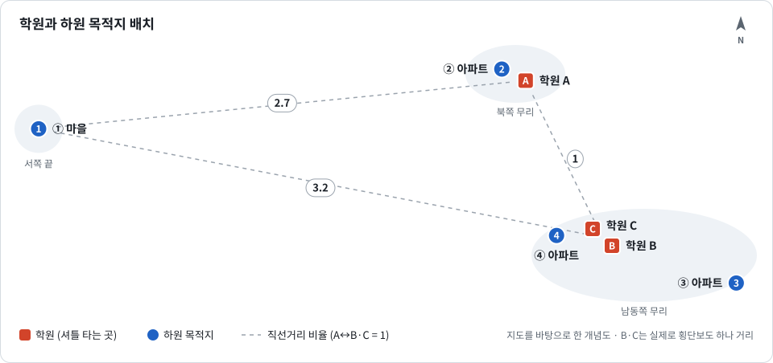

# 학원 셔틀 배차 최적화

학원 셔틀 한 대로 세 학원 학생들의 하원을 맡을 때, **언제 어디로 운행할지 정하는 일을 돕는** 서비스입니다.

> **지금 단계:** 실제 운영에 쓸 수 있는 첫 버전입니다. 효과 수치는 실제 운행 기록이 아직 없어 알려진 조건과 가정으로 만든 시뮬레이션 결과입니다.

## 풀려는 문제

학원 세 곳이 스타렉스 셔틀 한 대를 함께 씁니다. 수업이 끝나면 학생들은 이 셔틀을 타고 크게 네 곳으로 흩어져 집에 갑니다.

초등반은 학생마다 진도대로 공부하다가 끝나는 대로 나오기 때문에, 언제 몇 명이 나올지 미리 알 수 없습니다. 지금은 선생님이 단톡방에 "몇 시에 어디로 가는 학생 있음"을 올리면, 기사님이 그때그때 지점을 돌며 태웁니다.

그래서 이 프로젝트는 미리 시간표를 짜기보다, 운행 중에 계속 내려야 하는 판단을 돕는 것을 목표로 합니다.

- 요청이 들어오면 **바로 출발할지, 조금 기다렸다가 묶어서 갈지**
- **어느 학원을 먼저** 들르고 **어떤 순서로** 내려 줄지
- 운행이 없을 때 **어디서 기다릴지**

## 현장 한눈에 보기

<p align="center">
  
</p>

| 구분 | 내용 |
|---|---|
| 셔틀 | 9인승 스타렉스 1대, 하원에만 사용 |
| 학원 | A 초등반, B 초·중등반, C 중·고등반 (B와 C는 횡단보도 하나 사이) |
| 하원 목적지 | ① 마을 1곳, ②·③·④ 아파트 단지 3곳 |
| 이동 시간 | A↔B·C 약 4~6분, 각 학원에서 ①까지 약 10분 |
| 지금 운행 | 단톡방 요청을 보고 기사님이 그때그때 대응 |

자세한 상황은 [문제 정의](docs/problem.md)에 정리해 두었습니다.

## 해결 방안

단톡방 대신 **버튼으로 셔틀을 부르고**, **배차 엔진이 운행 순서를 정해 기사님께 안내**하며, 모두에게 **셔틀 도착 예정 시각**을 보여 줍니다.

- **선생님 화면:** 목적지와 인원을 눌러 셔틀을 부릅니다. "5분 뒤 끝남"처럼 미리 알릴 수 있고, 누르는 즉시 도착 예정 시각이 보입니다. 셔틀이 다가오면 진동과 소리로 알려 줍니다.
- **배차 엔진:** 요청이나 셔틀 도착이 있을 때마다, 알려진 요청 전체로 가장 좋은 정류장 순서를 다시 계산합니다.
- **기사님 화면:** 다음 할 일 한 줄과 버튼 하나만 보여 줍니다. 학원에서는 실제로 탄 학생을 확인하고, 안 나온 학생은 미탑승으로 처리합니다. 음성 안내를 켤 수 있습니다.
- **현황판:** 셔틀 위치, 기다리는 학생, 오늘의 대기 시간과 운전 시간을 보여 줍니다.
- **기기 연결:** QR 코드를 찍으면 선생님·기사님 휴대폰에 각자의 화면이 열립니다.
- **시뮬레이터:** 지금 방식과 자동 배차를 가상의 하루로 비교합니다.

설계와 가정은 [해결 방안](docs/solution.md)에 정리했습니다.

## 효과 (시뮬레이션)

가상의 하루 200일(하루 평균 학생 35명)에 같은 요청을 넣어 비교했습니다.

| 운행 규칙 | 평균 대기 | 평균 귀가 시간 | 20분 안에 귀가 | 하루 운전 |
|---|---:|---:|---:|---:|
| 요청 순서대로 (지금 방식) | 16.4분 | 26.2분 | 43% | 219분 |
| 정시 출발 | 20.5분 | 33.2분 | 21% | 203분 |
| **자동 배차** | **6.9분** | **18.3분** | **65%** | **194분** |

자동 배차는 학생 대기를 절반 아래로 줄이고, 기사님 운전도 하루 25분쯤 줄입니다. 선생님이 미리 알릴수록 효과가 커집니다. 자세한 결과와 조건은 [해결 방안의 시뮬레이션 결과](docs/solution.md#6-시뮬레이션-결과)에 있습니다.

## 실제로 쓰기

Python 3.10 이상이 필요합니다.

```bash
pip install -e .
SHUTTLE_ACCESS_CODE=학원-코드 python -m app      # http://localhost:8000
```

1. **원장님:** 처음 화면의 **기기 연결**에서 선생님·기사님 휴대폰으로 QR 코드를 찍게 합니다.
2. **선생님:** 학생이 끝나면 목적지와 인원을 눌러 셔틀을 부르고, 도착 알림이 오면 학생을 내보냅니다.
3. **기사님:** 화면의 한 줄 안내대로 **출발 → 도착했어요 → 탑승 완료**를 누르며 운행합니다.

기사님은 운행 중에 모바일 데이터를 쓰므로, 실제 운영에서는 서버를 인터넷에서 접속할 수 있는 곳에 올려야 합니다. 서버 준비, 역할별 사용법, 문제가 생겼을 때 할 일은 [실사용 안내](docs/usage.md)에 정리했습니다.

| 환경 변수 | 기본값 | 설명 |
|---|---|---|
| `SHUTTLE_ACCESS_CODE` | 없음 | 학원 코드. 정하면 코드를 입력한 기기만 쓸 수 있습니다. 인터넷에 올릴 때는 꼭 정하세요. |
| `SHUTTLE_DATA_DIR` | `var` | 하루치 운행 기록을 남기는 폴더. 서버를 다시 켜면 그날 상황을 이어 갑니다. |
| `SHUTTLE_CONFIG` | 없음 | 실제 지명과 이동 시간을 담은 로컬 설정 파일 ([예시](shuttle.local.example.json)) |
| `SHUTTLE_POLICY` | `optimized` | `optimized` (자동 배차), `fcfs` (요청 순서대로), `fixed` (정시 출발) |
| `SHUTTLE_MODE` | `real` | `real` (실제 운행) 또는 `demo` (시연) |
| `PORT` | `8000` | 서버 포트 |
| `FORWARDED_ALLOW_IPS` | `127.0.0.1` | 호스팅의 프록시 뒤에서 돌릴 때 `*` (Dockerfile에 들어 있음) |

### Docker

```bash
docker build -t hawon-shuttle .
docker run -d -p 8000:8000 -v shuttle-data:/data -e SHUTTLE_ACCESS_CODE=학원-코드 hawon-shuttle
```

### 시연해 보기

```bash
SHUTTLE_MODE=demo python -m app
```

시계가 15:20부터 30배속으로 흐르고, 가상의 선생님들이 셔틀을 부르며 셔틀도 저절로 움직입니다. 현황판 아래 **시연 설정**에서 운행 규칙과 속도를 바꿔 처음부터 다시 볼 수 있습니다. `SHUTTLE_SPEED`, `SHUTTLE_START`, `SHUTTLE_DEMO_REQUESTS`로 시연 조건을 정할 수 있습니다.

### 시뮬레이션과 테스트

```bash
pip install -e ".[dev]"
python -m shuttle.simulate --days 200 --seed 1   # 운행 규칙 비교표
pytest                                            # 테스트
```

## 진행 상황

- [x] 학원과 하원 목적지 위치 확인
- [x] 운영 방식, 좌석 수, 주요 구간 이동 시간 파악
- [x] 해결 방안 설계
- [x] 배차 엔진과 시뮬레이터
- [x] 선생님·기사님 화면과 현황판
- [x] 시뮬레이션으로 운행 규칙 비교
- [x] 실사용 흐름: 탑승 확인과 미탑승, 도착 알림, 기록 복원, 학원 코드, 기기 연결
- [ ] 서버를 인터넷에 올려 실제 운행 시작
- [ ] 실제 운행 기록으로 이동 시간과 효과 확인

## 기술 구성

- **배차 엔진·시뮬레이터:** Python (외부 라이브러리 없음)
- **웹 서버:** FastAPI, Uvicorn. 하루치 기록은 날짜별 파일(JSONL)에 쌓고, 다시 켤 때 다시 읽어 복원
- **화면:** HTML, CSS, JavaScript (빌드 과정 없음). 실시간 갱신은 서버 전송 이벤트(SSE), QR 코드는 qrcode-generator (MIT)
- **배포:** Docker

## 데이터와 개인정보

이 저장소는 공개 저장소입니다.

- 학생 이름, 집 주소, 연락처는 커밋하지 않습니다.
- 서비스가 쌓는 실제 운행 기록과 메모(학생 이름 등)는 서버의 기록 폴더에만 저장하고, 저장소에 올리지 않습니다.
- 실제 지명과 좌표 대신 학원 A·B·C, 목적지 ①~④ 같은 기호를 씁니다.
- 예제와 테스트에는 예시로 만든 데이터만 씁니다.

## 저장소 구성

```text
.
├── shuttle/                  # 배차 엔진
│   ├── network.py            # 정류장, 이동 시간, 로컬 설정 읽기
│   ├── planner.py            # 최적 정류장 순서 계산
│   ├── policies.py           # 운행 규칙 3가지
│   ├── dispatcher.py         # 요청과 셔틀 상태 관리
│   ├── demand.py             # 시뮬레이션용 가상 수요
│   └── simulate.py           # 운행 규칙 비교
├── app/                      # 웹 서비스
│   ├── main.py               # API, 학원 코드 확인, 화면 연결
│   ├── service.py            # 시계, 요청·기사님 동작 처리, 하루치 기록과 복원
│   └── static/               # 선생님·기사님 화면, 현황판, 기기 연결, 코드 입력
├── tests/                    # 테스트
├── docs/
│   ├── problem.md            # 현장 상황과 문제 정의
│   ├── solution.md           # 해결 방안, 가정, 시뮬레이션 결과
│   ├── usage.md              # 실사용 안내
│   └── images/sites.svg      # 학원과 하원 목적지 배치 개념도
├── Dockerfile
├── shuttle.local.example.json
└── pyproject.toml
```

## 라이선스

[MIT](LICENSE)
