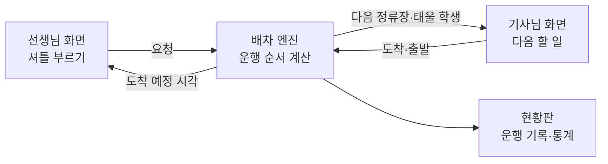

# 해결 방안

[문제 정의](problem.md)에 정리한 상황을 해결하기 위한 방안과, 그 방안을 담은 서비스의 설계입니다.

- 마지막 수정: 2026-09-23
- 현장에서 얻을 수 있는 정보는 문제 정의에 적은 것이 전부입니다. 모르는 값은 [가정](#5-가정)으로 채우고, 서비스에서는 설정값으로 두어 나중에 바꿀 수 있게 합니다.

## 1. 한 줄 요약

단톡방 대신 **버튼으로 셔틀을 부르고**, **배차 엔진이 운행 순서를 정해 기사님께 안내**하며, 모두에게 **셔틀 도착 예정 시각**을 보여 주는 서비스입니다.

## 2. 지금 방식에서 생기기 쉬운 문제

- **묶어 갈 기회를 놓칩니다.** 요청이 올라온 순서대로 대응하면, 같은 방향 학생을 따로 실어 나르게 됩니다. 예를 들어 A와 B·C에서 ①로 가는 학생을 따로 보내면 약 40분이 들지만, 묶으면 약 25분이면 됩니다.
- **셔틀이 언제 올지 아무도 모릅니다.** 학생과 선생님은 막연히 기다리고, 단톡방에 다시 묻게 됩니다.
- **기사님이 운전 중에 단톡방을 봐야 합니다.** 안전에 좋지 않습니다.
- **기록이 남지 않습니다.** 언제 어디로 몇 명이 가는지 모르니 운행을 개선할 근거가 없습니다.

## 3. 서비스 구성

### 선생님 화면: 셔틀 부르기

- 학원(A·B·C)을 고르고, 목적지(①~④)와 인원을 누르면 요청이 들어갑니다.
- "지금 끝남"뿐 아니라 "5분 뒤", "10분 뒤"처럼 미리 알릴 수 있습니다. 초등반은 끝나는 시각이 불규칙하지만, 선생님은 학생이 곧 끝날지 대략 압니다. 이 정보가 있으면 엔진이 셔틀을 헛걸음 없이 맞춰 보낼 수 있습니다.
- 요청하자마자 셔틀 도착 예정 시각이 보이고, 운행 계획이 바뀌면 함께 바뀝니다.

### 배차 엔진

- 요청이 들어오거나 셔틀이 정류장에 도착·출발할 때마다, 그때까지 알려진 요청 전체를 보고 운행 순서를 다시 계산합니다.
- 다음 정류장까지만 확정하고 나머지는 계속 고칩니다.
- 원리는 [4장](#4-배차-엔진의-원리)에 정리했습니다.

### 기사님 화면: 다음 할 일

- 큰 글씨 한 줄로 다음 할 일만 보여 줍니다. 예: "B·C에서 3명 태우기 (④ 2명, ② 1명)".
- 정류장에 도착하면 버튼 하나만 누릅니다. 운전 중에 채팅을 읽을 필요가 없습니다.
- 이후 계획(정류장 순서와 예정 시각)은 아래에 작게 보여 줍니다.

### 현황판과 기록

- 기다리는 요청, 셔틀 위치, 오늘의 대기 시간과 운전 시간을 한눈에 봅니다.
- 모든 요청과 운행이 자동으로 기록됩니다. 지금은 없는 "언제, 어디서, 어디로, 몇 명" 데이터가 쌓이고, 이 기록으로 운행 규칙과 가정을 고쳐 나갈 수 있습니다.

## 4. 배차 엔진의 원리

### 계산하는 것

셔틀의 앞으로의 정류장 순서입니다. 정류장마다 누구를 태우고 누구를 내리는지, 몇 시에 도착하는지까지 함께 정합니다.

### 지켜야 할 것

- 차 안의 학생은 좌석 수(8명)를 넘지 않습니다.
- 학생은 준비된 시각 이후에만 탑니다. 셔틀이 먼저 도착하면 기다립니다.
- 태운 학생만 내려 줄 수 있고, 한 번 태운 학생은 집에 내려 줄 때까지 차에 있습니다.
- 한 학생이 너무 오래 기다리지 않도록 대기 시간 상한을 둡니다(기본 30분).

### 좋고 나쁨을 재는 기준

- **주 기준:** 학생마다 준비된 시각부터 집에 도착하기까지 걸린 시간의 합
- **보조 기준:** 기사님 운전 시간 (같은 조건이면 덜 운전하는 계획)

### 계산 방법

정류장이 학원 2곳(A, B·C)과 목적지 4곳뿐이고 차량이 1대라서, 가능한 정류장 순서를 모두 따져 보고 가장 좋은 것을 고를 수 있습니다. 어차피 불가능하거나 이미 더 나쁜 순서는 중간에 잘라 내어 계산을 줄입니다(분기 한정법). 요청이 한꺼번에 많이 몰리면, 준비 시각이 이른 순서로 일부만 계산에 넣습니다.

### 운행 규칙

엔진은 세 가지 규칙으로 돌릴 수 있고, 시뮬레이터로 비교합니다.

| 규칙 | 설명 |
|---|---|
| 요청 순서대로 | 지금 방식을 흉내 냅니다. 먼저 올라온 요청의 학원에 가서, 그곳에 준비된 학생을 태우고 가까운 순서로 내려 줍니다. |
| 자동 배차 | 알려진 요청 전체로 가장 좋은 순서를 계산합니다. 곧 준비될 학생을 기다렸다가 묶어 가는 것도 계산에 포함됩니다. |
| 정시 출발 | 학원마다 정해진 간격(예: 20분)으로만 출발합니다. 학생은 다음 출발 시각까지 기다립니다. 앱 없이도 운영할 수 있는 방식입니다. |

## 5. 가정

현장에서 더 얻을 수 없는 값들입니다. 서비스에서는 모두 설정값으로 둡니다.

### 좌석과 운행 시간대

- 학생 좌석: 8석 (9인승에서 운전석 제외)
- 셔틀 운행: 15:00~21:30

### 이동 시간 (분)

기사님이 알려 주신 값은 **굵게** 표시했고, 나머지는 지도 위치로 추정했습니다. B와 C는 횡단보도 하나 사이라 같은 정류장(B·C)으로 봅니다. 정류장에서 타고 내리는 데 1분이 걸린다고 봅니다.

| | A | B·C | ① | ② | ③ | ④ |
|---|---|---|---|---|---|---|
| **A** | | **5** | **10** | 1 | 7 | 4 |
| **B·C** | **5** | | **10** | 5 | 3 | 2 |
| **①** | **10** | **10** | | 10 | 12 | 9 |
| **②** | 1 | 5 | 10 | | 7 | 4 |
| **③** | 7 | 3 | 12 | 7 | | 3 |
| **④** | 4 | 2 | 9 | 4 | 3 | |

### 셔틀을 타는 학생 (시뮬레이션용 가상 수요)

실제 인원은 알 수 없으므로 알려 주신 규칙에 맞춰 가상의 하루를 만듭니다.

| 학원 | 끝나는 방식 | 셔틀 이용 | 목적지 |
|---|---|---|---|
| A (초등) | 15:30~19:30 사이 불규칙 | 하루 약 20명 | ① ③ ④ (②는 바로 옆이라 타지 않음) |
| B (초·중등) | 16:00~20:30 사이 불규칙 | 하루 약 14명 | ① ② ③ (④는 가까워 타지 않음) |
| C (중·고등) | 정해진 시각에 한꺼번에 | 거의 없음 (하루 0~3명) | ① ② ③ |

- 한 번 요청에 1~3명이 함께 나옵니다.
- 요청의 절반쯤은 선생님이 5~10분 전에 미리 알린다고 봅니다.
- 시뮬레이션 결과는 이 가정에 따른 값이므로, 실제 효과는 서비스를 쓰면서 쌓이는 기록으로 다시 확인해야 합니다.

## 6. 첫 버전 범위

- 배차 엔진과 세 가지 운행 규칙
- 시뮬레이터: 가상의 하루를 여러 번 만들어 규칙별 학생 대기 시간, 집 도착까지 걸린 시간, 운전 시간을 비교
- 선생님 화면, 기사님 화면, 현황판 (휴대폰 브라우저용)
- 시연용 빠른 시계: 하루 운행을 몇 분 만에 재생

## 7. 이후 확장

- 학부모에게 셔틀 도착 예정 알림
- 기사님 화면 음성 안내
- 쌓인 기록으로 이동 시간과 운행 규칙 자동 보정
- 지도 위 실시간 셔틀 위치
